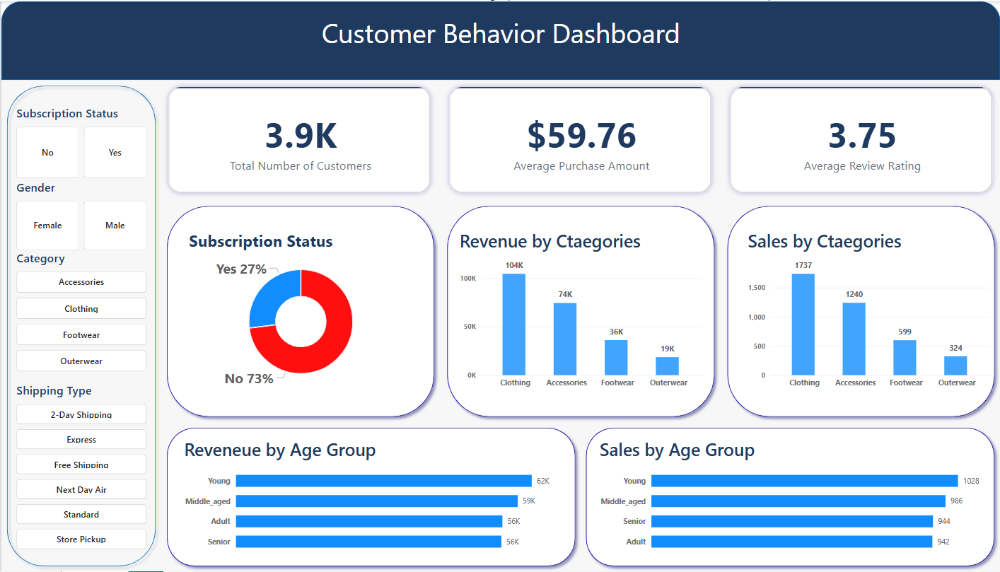
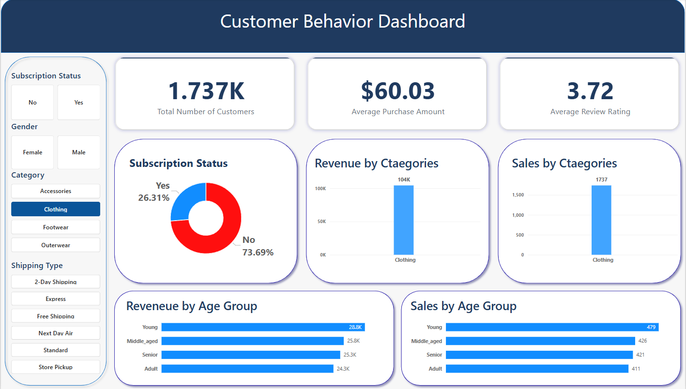
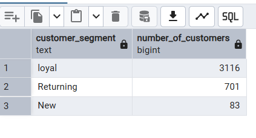
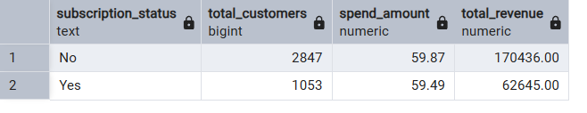
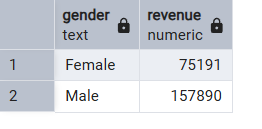

# Retail Customer Behavior Analysis | Python, SQL, PostgreSQL, Power BI


## Project Overview (Quick Understanding)


This project analyzes retail customer shopping behavior to identify **what drives revenue, repeat purchases, and customer engagement**.

Built using **Python, SQL, PostgreSQL, and Power BI**, the project transforms raw data into **clear business decisions** through structured analysis and visualization.

---

## Why This Project Matters

Retail companies collect large amounts of customer data but often struggle to turn it into actionable strategy.

This project answers key business questions:
- What drives revenue the most?
- Which customers are most valuable?
- Does subscription actually increase spending?
- How do discounts and shipping affect behavior?

---

## Key Insights (Executive Summary)

- **Clothing is the top revenue category** → primary growth driver  
- **Male customers generate higher revenue** → key target segment  
- **Young & Middle-aged groups dominate spending** → focus demographic  
- **Loyal customers form the largest base** → strong retention opportunity  
- **Subscription has minimal impact on spending** → needs improvement  
- **Discounts and shipping influence behavior differently** → strategic use required  

---

## Dashboard Preview

### Executive Dashboard


### Interactive Filter Example


---

## SQL Analysis (Proof of Work)

### Customer Segmentation


### Subscription Comparison


### Revenue by Gender


---

## Approach

This project follows a real-world analytics workflow:

1. Data cleaning and preprocessing using Python  
2. Data storage and querying using PostgreSQL  
3. Business analysis using SQL  
4. Visualization using Power BI  
5. Insight generation and business recommendations  

---

## Tools & Technologies

- Python (Pandas)
- SQL
- PostgreSQL
- Power BI
- Jupyter Notebook

---

## Business Recommendations

- Improve the value of the **subscription model**
- Focus on **high-performing categories (Clothing)**
- Target **Male, Young, and Middle-aged customers**
- Use **discounts selectively** to protect margins
- Strengthen **loyalty-based retention strategies**
- Optimize **shipping strategy for customer experience**

---

## Repository Structure


## Repository Structure

```bash
retail-customer-behavior-analysis/
├─ data/
│  ├─ raw/
│  │  └─ customer_shopping_behavior.csv
│  └─ processed/
│     └─ cleaned_data.csv
├─ sql/
│  └─ customer_behavior_analysis.sql
├─ notebooks/
│  └─ Data_Exploration.ipynb
├─ dashboard/
│  └─ Customer_Behavior_Analysis_Dashboard.pbix
├─ presentation/
│  └─ Retail_Customer_Behavior_Analysis.pptx
├─ report/
│  └─ Retail_Customer_Behavior_Analysis_Report.pdf
├─ screenshots/
│  ├─ dashboard_overview.png
│  ├─ dashboard_subscription_yes.png
│  ├─ dashboard_subscription_no.png
│  ├─ dashboard_clothing_filter.png
│  ├─ dashboard_shipping_filter.png
│  ├─ sql_customer_segmentation.png
│  ├─ sql_subscription_comparison.png
│  ├─ sql_revenue_by_gender.png
│  ├─ sql_revenue_by_age_group.png
│  └─ Retail_Customer_Behavior_Insights_Map.png
└─ README.md
